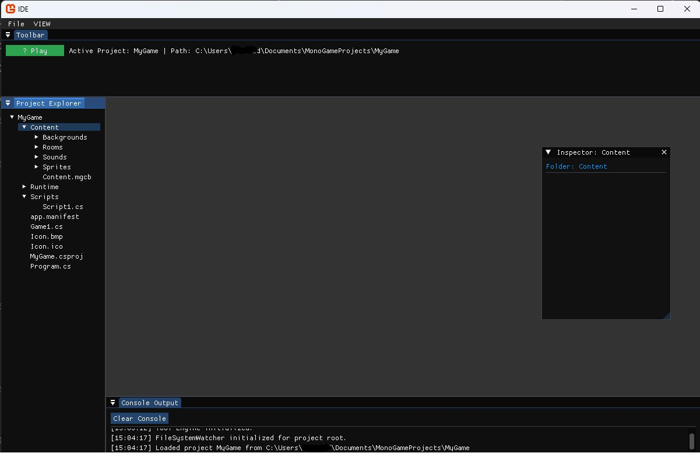
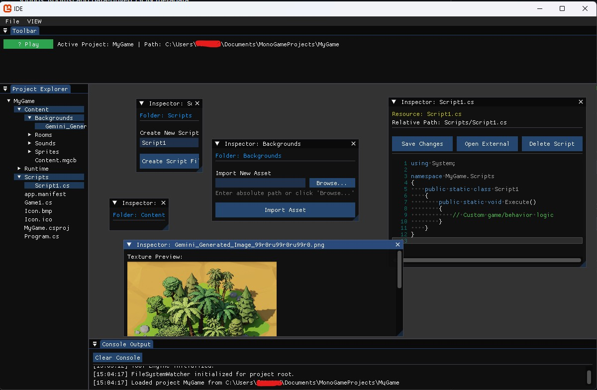
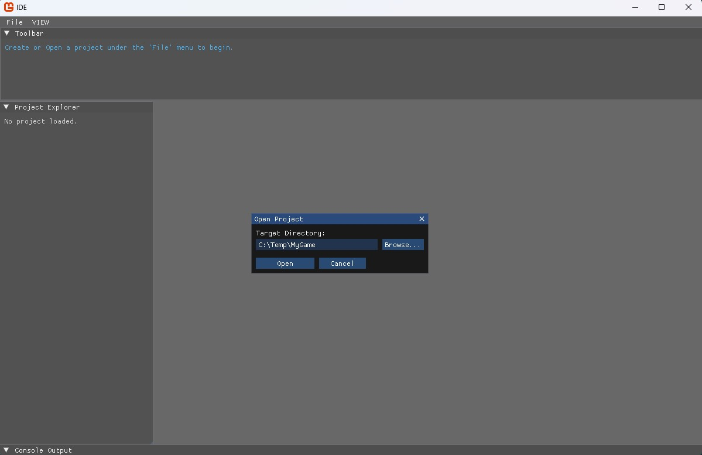

# Mono GameMaker - Project Orchestrator

Mono GameMaker is a lightweight, pragmatically designed desktop IDE (MVP) built to orchestrate MonoGame projects. It abstracts the configuration of `mgcb-cli` and structures projects using logical folders (Sprites, Backgrounds, Sounds, Rooms) and data-driven JSON metadata.

## Screenshots

| Workspace Layout | Code Editor & Inspector | Open Project Dialog |
| :---: | :---: | :---: |
|  |  |  |


## Key Features

1. **Immediate Mode UI**: Built on top of MonoGame using `ImGui.NET`, providing high-performance widgets with low boilerplate and zero MVVM/XAML overhead.
2. **Reactive Filesystem Cache**: Monitored by a thread-safe `FileSystemWatcher` featuring a 150ms debounce window. Filesystem changes are scanned in the background and safely swapped using reference locking to prevent UI frame drops and collection modification exceptions.
3. **Native Window Splits & Layouts**: Uses custom P/Invoke bindings directly to `cimgui.dll` to perform programmatic window splits. You can toggle layouts from the **VIEW** menu:
   - **Default Layout**: Toolbar (top), Project Explorer (left), Inspector (right), and Console Output (bottom).
   - **Wide Console Layout**: Expands the logs window to 60% of the center workspace.
   - **Focused Editor Layout**: Minimizes panels to maximize canvas workspace.
4. **Data-Driven Room Editor**: Contains an interactive coordinate inspector to add, delete, and modify entity instances (X/Y coordinates) mapped to `room_init.json` layout configurations.
5. **Boilerplate Scaffolding**: Automates target framework overrides, asset synchronizations (injecting items inside `Content.mgcb`), and runs compilers dynamically inside async tasks.

---

## How to Run

To run the IDE in development mode, execute:

```bash
dotnet run --project src/IDE/IDE.csproj
```

Alternatively, you can open the published Windows executable directly:
`src/IDE/bin/Release/net8.0/win-x64/publish/IDE.exe`

---

## License

This project is licensed under a **Custom Source-Available Non-Commercial Tool License**:
* **You CAN**: Download, modify, compile the source code, send pull requests, and use the tool (editor & runtime) to create and compile video games to be sold **commercially** for profit.
* **You CANNOT**: Sell, lease, rent, or commercially distribute copies or modified versions of the tool itself (the editor/IDE IDE.exe).

See the [LICENSE](LICENSE) file for the full legal terms.
