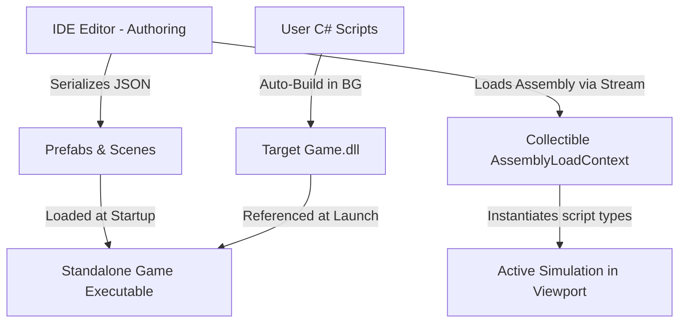

# IDE Architecture & Hot Reload System

This document outlines the design of the Mono GameMaker IDE, detailing how the editor separates authoring from execution, triggers background compilation, executes real-time script simulation via dynamic hot reloading, and uses reflection to build the inspector.

---

## 1. Architectural Separation: Authoring vs. Runtime

Mono GameMaker enforces a clean boundary between the IDE application and the user's game runtime.



*   **Authoring (IDE)**: The editor is an ImGui-based visual editor (`IDE.csproj`). It reads, edits, and serializes scene configurations (`.json`) and prefab setups (`.prefab`). The IDE does not contain custom component scripts; it uses reflection to run user scripts inside the scene layout view.
*   **Runtime (Engine)**: The target game (`Game1.cs` scaffolded via `TemplateEngine.cs`) compiles into a standalone executable. It references the same shared contracts (`MonoGameMaker.Runtime`) inside `IDE.dll` to parse assets, build entities, and execute level loops without duplicate code.

---

## 2. Background Compilation & Hot Reload Flow

To make development fast and allow AI agents to test behavior changes in real time, the IDE implements a background compiler and dynamic assembly loader.

### Detailed Workflow

1.  **File Change Detection**:
    The IDE maintains a file watcher class `FileSystemCache.cs` monitoring the project directory. When a C# script file (`.cs`) inside the project is modified or created, it asynchronously fires:
    `Task.Run(() => AssemblyReloader.CompileAndLoad(...))`
2.  **Silent MSBuild Execution**:
    The service launches `dotnet build --configuration Debug` silently in the background using `ProcessStartInfo`. Output streams (Stdout/Stderr) are captured.
3.  **Log Redirection**:
    *   If compilation fails, the compiler output is captured and redirected to `GlobalState.Log(output)`.
    *   The `ConsoleLogsWindow` (ImGui logs panel) displays the compiler warning and error list instantly. This enables AI coding assistants or developers to identify syntax mistakes and recover without leaving the application.
4.  **Dynamic Assembly Load Context (ALC)**:
    *   To allow unloading previous assembly versions and prevent memory leaks, a collectible `AssemblyLoadContext` is instantiated:
        `_currentContext = new AssemblyLoadContext(isCollectible: true)`
    *   Before loading, the previous context's `Unload()` method is invoked, and `GC.Collect()` with `GC.WaitForPendingFinalizers()` are forced to purge unused type instances.
5.  **Memory-Stream Assembly Loading (Zero-Lock)**:
    *   A typical assembly load locks the target `.dll` file, preventing subsequent compilation builds from overwriting the file.
    *   To bypass this, the file bytes are read into memory first:
        `byte[] dllBytes = File.ReadAllBytes(dllPath);`
    *   The assembly is loaded entirely from a memory stream:
        `loadContext.LoadFromStream(new MemoryStream(dllBytes))`
    *   This ensures the physical DLL file on disk remains unlocked at all times, allowing seamless continuous builds.

---

## 3. Reflection-Based Inspector

The IDE's property inspector (`InspectorWindow.cs`) dynamically adapts to the selected scene entity (`GlobalState.SelectedNode`) without hardcoded widget definitions.

### How it Works

1.  **Prefab Script Lookup**:
    When an entity is selected, the inspector looks up its prefab metadata to read the attached `ScriptName`.
2.  **Active Simulation Reflection**:
    If play mode simulation is active, the inspector searches the active simulated entity list inside the loaded assembly's `EntityManager.Entities`.
3.  **Reflection-Based Rendering**:
    The inspector obtains the type of the active script:
    `Type type = scriptInstance.GetType();`
    It loops through public fields and read-write properties using:
    *   `type.GetFields(BindingFlags.Public | BindingFlags.Instance)`
    *   `type.GetProperties(BindingFlags.Public | BindingFlags.Instance)`
4.  **ImGui Widget Mapping**:
    The inspector uses a switch-expression over the variable type to bind values to ImGui input widgets. Because ImGui edits variables using pointer references, local variables are modified and written back using reflection:
    ```csharp
    if (field.FieldType == typeof(float)) {
        float floatVal = (float)field.GetValue(obj);
        if (ImGui.DragFloat($"##F_{id}", ref floatVal))
            field.SetValue(obj, floatVal);
    }
    ```
5.  **Simulation Lockout**:
    When play mode is active, the scene data inputs are disabled using `ImGui.BeginDisabled()` to prevent coordinate corruption, while the inspector shows live script values.
