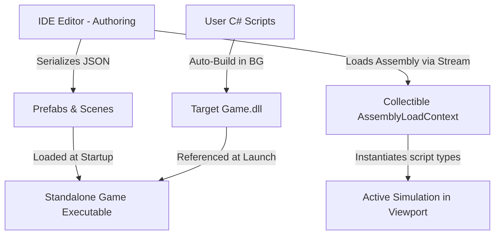
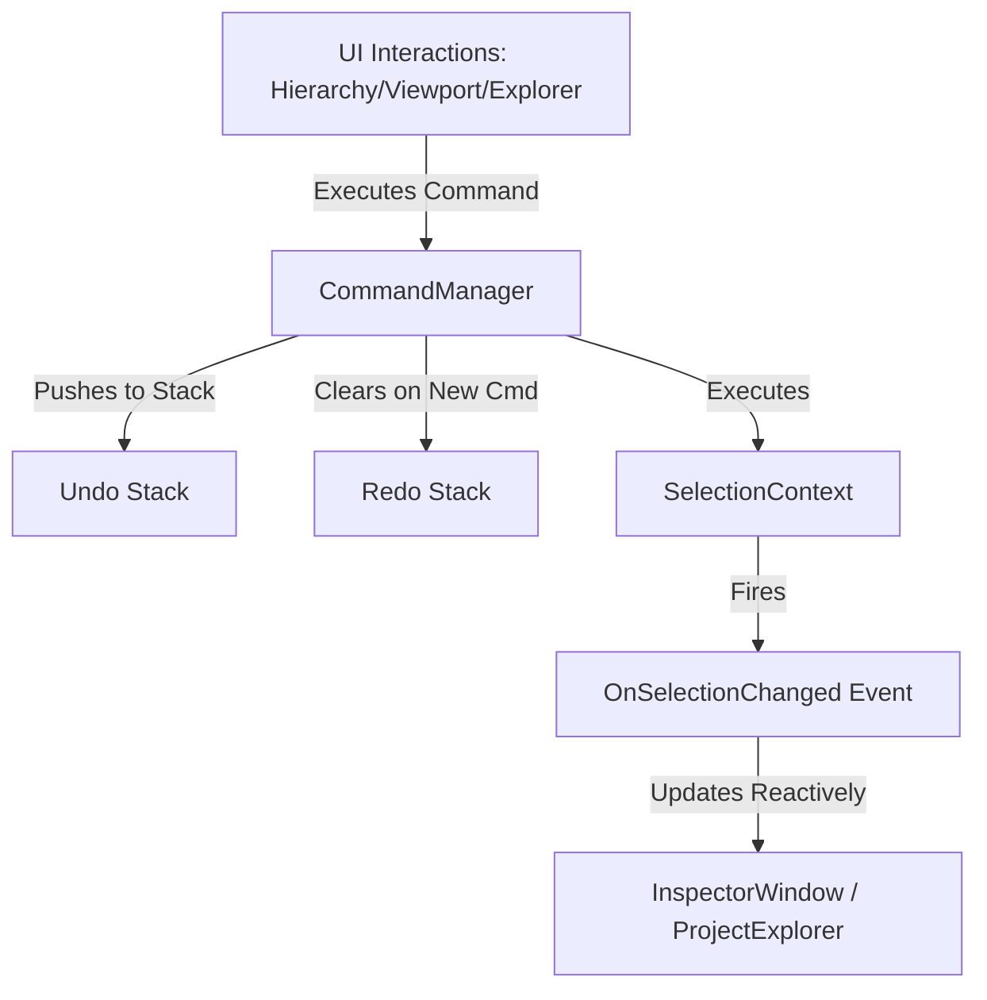

# IDE Architecture & Hot Reload System

This document outlines the design of the Mono GameMaker IDE, detailing how the editor separates authoring from execution, triggers background compilation, executes real-time script simulation via dynamic hot reloading, and uses reflection to build the inspector.

---

## 1. Architectural Separation: Authoring vs. Runtime

Mono GameMaker enforces a clean boundary between the IDE application and the user's game runtime.



*   **Authoring (IDE)**: The editor is an ImGui-based visual editor (`IDE.csproj`). It reads, edits, and serializes scene configurations (`.json`) and prefab setups (`.prefab`). The IDE does not contain custom component scripts; it uses reflection to run user scripts inside the scene layout view.
*   **Runtime (Engine)**: The target game (`Game1.cs` scaffolded via `TemplateEngine.cs`) compiles into a standalone executable. It references the same shared contracts (`MonoGameMaker.Runtime`) inside `IDE.dll` to parse assets, build entities, and execute level loops without duplicate code.

---

## 2. Background Compilation & Hot Reload Flow

To make development fast and allow AI agents to test behavior changes in real time, the IDE implements a background compiler and dynamic assembly loader.

### Detailed Workflow

1.  **File Change Detection**:
    The IDE maintains a file watcher class `FileSystemCache.cs` monitoring the project directory. When a C# script file (`.cs`) inside the project is modified or created, it asynchronously fires:
    `Task.Run(() => AssemblyReloader.CompileAndLoad(...))`
2.  **Silent MSBuild Execution**:
    The service launches `dotnet build --configuration Debug` silently in the background using `ProcessStartInfo`. Output streams (Stdout/Stderr) are captured.
3.  **Log Redirection**:
    *   If compilation fails, the compiler output is captured and redirected to `GlobalState.Log(output)`.
    *   The `ConsoleLogsWindow` (ImGui logs panel) displays the compiler warning and error list instantly. This enables AI coding assistants or developers to identify syntax mistakes and recover without leaving the application.
4.  **Dynamic Assembly Load Context (ALC)**:
    *   To allow unloading previous assembly versions and prevent memory leaks, a collectible `CollectibleAssemblyLoadContext` (inheriting from `AssemblyLoadContext` with `isCollectible: true`) is instantiated.
    *   Before loading, the reload process triggers a strict deterministic cleanup:
        1. **`EntityManager.PurgeAllScripts()`** is invoked via reflection on the old assembly to dispose/teardown active scripts and clear static collections/reflection caches.
        2. A `WeakReference` is created pointing to the active `CollectibleAssemblyLoadContext`.
        3. `Unload()` is called on the old context, and strong references to it and the loaded assembly are removed.
        4. A forced collection loop runs up to 10 times executing `GC.Collect(GC.MaxGeneration, GCCollectionMode.Forced)` and `GC.WaitForPendingFinalizers()`, polling if the context is fully unloaded (`weakContext.IsAlive == false`).
        5. If the context is still alive, a warning is logged alerting about residual leaks.
5.  **Memory-Stream Assembly Loading (Zero-Lock)**:
    *   A typical assembly load locks the target `.dll` file, preventing subsequent compilation builds from overwriting the file.
    *   To bypass this, the file bytes are read into memory first:
        `byte[] dllBytes = File.ReadAllBytes(dllPath);`
    *   The assembly is loaded entirely from a memory stream:
        `loadContext.LoadFromStream(new MemoryStream(dllBytes))`
    *   This ensures the physical DLL file on disk remains unlocked at all times, allowing seamless continuous builds.

---

## 3. Reflection-Based Inspector

The IDE's property inspector (`InspectorWindow.cs`) dynamically adapts to the selected scene entity (`GlobalState.SelectedNode`) without hardcoded widget definitions.

### How it Works

1.  **Prefab Script Lookup**:
    When an entity is selected, the inspector looks up its prefab metadata to read the attached `ScriptName`.
2.  **Active Simulation Reflection**:
    If play mode simulation is active, the inspector searches the active simulated entity list inside the loaded assembly's `EntityManager.Entities`.
3.  **Reflection-Based Rendering**:
    The inspector obtains the type of the active script:
    `Type type = scriptInstance.GetType();`
    It loops through public fields and read-write properties using:
    *   `type.GetFields(BindingFlags.Public | BindingFlags.Instance)`
    *   `type.GetProperties(BindingFlags.Public | BindingFlags.Instance)`
4.  **ImGui Widget Mapping**:
    The inspector uses a switch-expression over the variable type to bind values to ImGui input widgets. Because ImGui edits variables using pointer references, local variables are modified and written back using reflection:
    ```csharp
    if (field.FieldType == typeof(float)) {
        float floatVal = (float)field.GetValue(obj);
        if (ImGui.DragFloat($"##F_{id}", ref floatVal))
            field.SetValue(obj, floatVal);
    }
    ```
5.  **Simulation Lockout**:
    When play mode is active, the scene data inputs are disabled using `ImGui.BeginDisabled()` to prevent coordinate corruption, while the inspector shows live script values.

---

## 4. Automatic Legacy Project Migration (ProjectMigrator)

To maintain backwards compatibility and simplify development workflows when legacy project folders are loaded into the editor, the IDE utilizes an automatic and idempotent migration pipeline (`ProjectMigrator.cs`).

### Core Mechanism

1.  **Trigger Points**:
    - **Open Project dialog**: Runs when a user opens an existing project through the IDE UI.
    - **Background compilation**: Triggers inside `AssemblyReloader.CompileAndLoad` to support command-line args or quick loads.
2.  **Upgrades Applied**:
    - **MSBuild Compliance**: Injects `<AllowUnsafeBlocks>true</AllowUnsafeBlocks>` and `<CopyLocalLockFileAssemblies>true</CopyLocalLockFileAssemblies>` to support the ImGui native vertex binding layout.
    - **Dependencies Synchronization**: Injects the appropriate `<PackageReference>` for `ImGui.NET` if it is missing.
    - **Script Signature Refactoring**: Scans all script classes under `Scripts/`. Converts inheritance syntax from the obsolete `: IEntityScript` interface to the abstract `EntityBehavior` class. Translates the legacy `Initialize(GameEntity, Dictionary<string, string>)` method signature into `public override void Awake()` while adjusting parameter name usages inside the method body.
3.  **Log Integration**:
    - Build diagnostic logs and migration output are routed directly to the `ConsoleLogsWindow` using `GlobalState.Log(...)`.

---

## 5. Simulation States & Focus-Based Input Isolation

To support proper play/pause simulation and protect user scripts from consuming inputs while the user interacts with the IDE, the framework implements a decoupled simulation lifecycle.

### State Transitions

- **Edit State**: Scripts do not run. Physics/animations are frozen. Camera is static.
- **Playing State**: Loop executes at a 60Hz fixed time step.
- **Paused State**: Script execution is halted. If `TriggerSingleFrame` is enabled, a single frame is updated (1/60th second step) and then paused state is restored.

### Focus-Based Interception Data Flow

1. **Focus Assessment**:
   The IDE determines if the game viewport has focus by querying ImGui:
   `GlobalState.IsViewportFocused = ImGui.IsWindowFocused(ImGuiFocusedFlags.ChildWindows)`
2. **Translation & Injection**:
   If focused, the real `KeyboardState` and viewport-translated `MouseState` are passed via reflection to the simulation assembly.
   If unfocused, empty instances (`new KeyboardState()`, `new MouseState()`) are sent, effectively isolating inputs.
3. **Global Shadowing**:
   User scripts use `global using Keyboard` and `global using Mouse` aliases pointing to shadow classes inside `MonoGameMaker.Runtime`. This abstracts the focus-based isolation layer from script code.

---

## 6. Selection Context & Command Pattern (Undo/Redo)

To support undo/redo capabilities and segregate monolithic state, the IDE isolates selections and property edits into distinct contexts and command objects.



### Core Components

1.  **SelectionContext**:
    *   Manages active selected node (`SelectedNode`) and file paths (`SelectedResourcePath`).
    *   Dispatches `OnSelectionChanged` event whenever a selection changes, enabling reactive UI updates instead of periodic polling.
2.  **CommandManager**:
    *   Maintains an `IEditorCommand` history stack (`_undoStack` and `_redoStack`).
    *   `ExecuteCommand(cmd)` executes the command, pushes it to the Undo stack, and clears the Redo stack.
3.  **IEditorCommand**:
    *   Exposes `Execute()` and `Undo()` contracts.
    *   **`SelectNodeCommand` & `SelectResourceCommand`**: Wraps selection state changes.
    *   **`ChangePropertyCommand`**: Wraps mutations to entity properties (e.g. coordinates `x`, `y`, or values in `CustomProperties`).
4.  **Obsolete wrappers on GlobalState**:
    *   Redirects legacy code reads to `SelectionContext` and writes to `CommandManager.ExecuteCommand`, maintaining backwards compatibility (Strangler Fig Pattern).
5.  **Keyboard Shortcuts**:
    *   Intercepts Ctrl+Z and Ctrl+Y key-press transitions via `InputManager` to invoke `CommandManager.Undo()` and `Redo()`.
