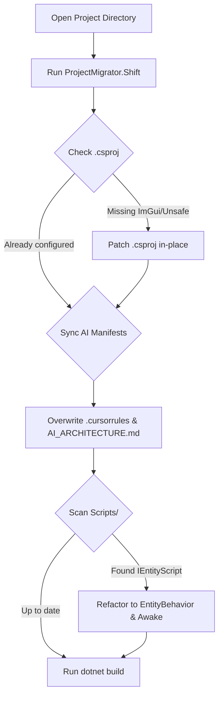

# ProjectMigrator Manual

The `ProjectMigrator` is a native utility designed to automatically update legacy project files to the latest architectural standards of Mono GameMaker when opened in the IDE.

---

## Migration Steps

When a project is loaded, the migrator executes the following idempotent tasks:

1. **`.csproj` Upgrades**:
   - **`AllowUnsafeBlocks`**: Checks if the target project compiles with `<AllowUnsafeBlocks>true</AllowUnsafeBlocks>`. If not, this is injected into the primary `<PropertyGroup>` to support pointer-based vertex copying for ImGui rendering.
   - **`CopyLocalLockFileAssemblies`**: Ensures `<CopyLocalLockFileAssemblies>true</CopyLocalLockFileAssemblies>` is set.
   - **`ImGui.NET` Package Reference**: Appends `<PackageReference Include="ImGui.NET" Version="1.91.6.1" />` if missing, allowing target user scripts to use ImGui without manually managing project references.

2. **AI Manifest Sync**:
   - Synchronizes/overwrites `.cursorrules` and `AI_ARCHITECTURE.md` with updated templates to enforce the usage of `EntityBehavior` instead of the deprecated `IEntityScript`.

3. **Legacy C# Script Refactoring**:
   - Scans the `Scripts/` directory for any files inheriting from `: IEntityScript` and replaces the inheritance with `: EntityBehavior`.
   - Converts the old `public void Initialize(GameEntity entity, Dictionary<string, string> properties)` signature into `public override void Awake()`, mapping variable names of the parameters to the base class properties `Entity` and `Properties`.

---

## Workflow Example

Below is the conceptual sequence when a legacy project is loaded:

